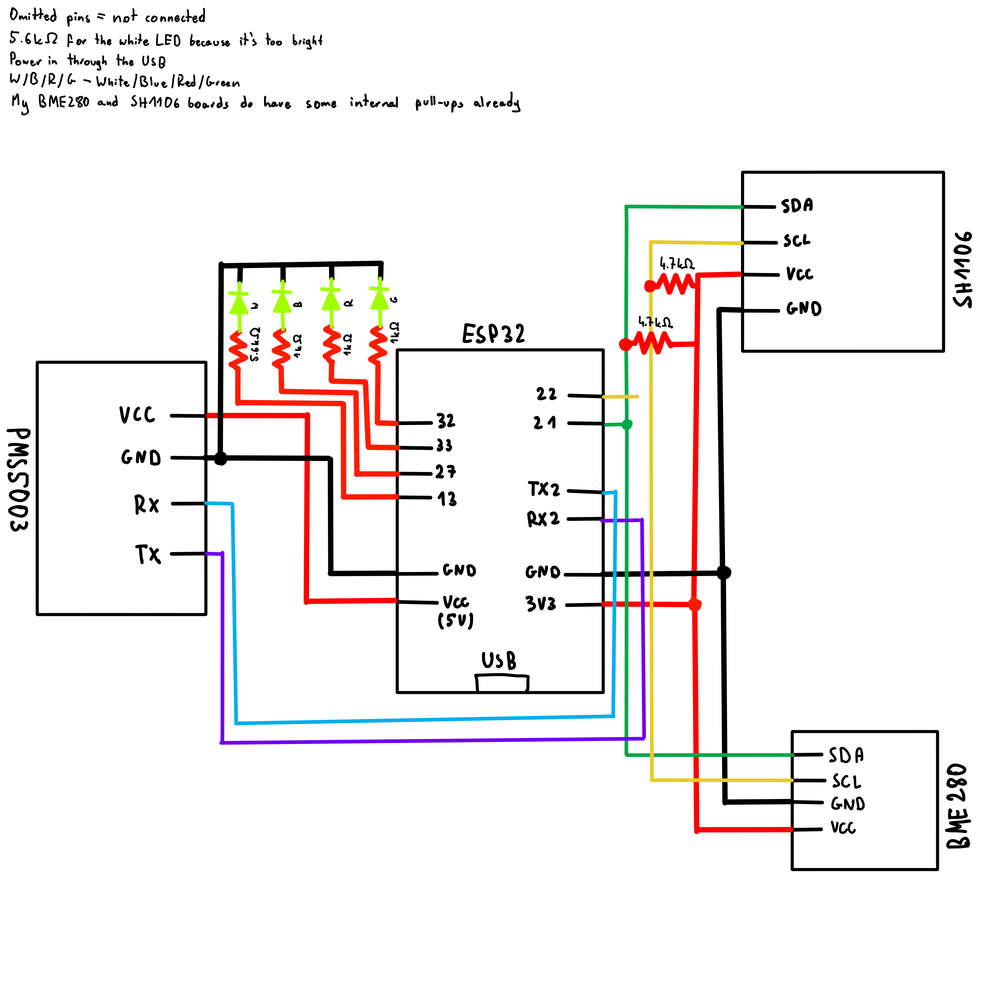

# Weather Station
ESP32-based weather station built with ESP-IDF, no third-party sensor libraries. A handmade rewrite of an earlier Arduino IDE version that relied on libraries. Also taken further: soldered onto a perfboard with a 3D printed enclosure instead of a breadboard.

Reads temperature, humidity, and pressure via a BME280 over I2C, monitors air quality with a PMS5003 over UART, and displays everything on an SH1106 OLED. A few diagnostic LEDs signal hardware faults on startup.

All sensor drivers written from scratch against the datasheets. Structured as pure header-only libraries - I wanted to experiment with this after building projects with both the classic .h/.c split and unity builds. Uses Raylib naming conventions, though I've since come to prefer [Tiger Style](https://tigerstyle.dev/#nouns-and-verbs). Font by [petabyt](https://github.com/petabyt/font). Startup logo generated with Claude.

## Demo
*Low res thumbnail — click to watch on YouTube*

## Schematic

## Build
`idf.py build flash monitor` (run from the root directory, not `main/`)

## Notes
- Enum names ended up too verbose - need to be more conservative with it
- Tiger Style's big-endian naming is so much better (`BME280_setup()` over `setup_BME280()`) - it reads better and works great with autocomplete
- camelCase is harder to read and is a headache sometimes (e.g. `0` followed by `O`, or `GetLEDGPIO`) - definitely use snake_case
